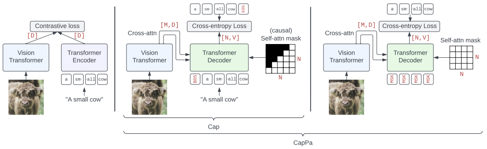

# Image Captioners Are Scalable Vision Learners Too

*by Michael Tschannen, Manoj Kumar, Andreas Steiner, Xiaohua Zhai, Neil Houlsby, Lucas Beyer* [[arxiv]](https://arxiv.org/abs/2306.07915)



This directory contains a config for training a CapPa model from scratch.
Note that most models in the paper were trained on a proprietary dataset
(WebLI), but similar results can be obtained by training on [LAION](https://laion.ai/).

By default, this config trains on COCO captions as this data set is readily
available in [TFDS](https://www.tensorflow.org/datasets) without manual steps.
This is not meant to produce a meaningful model, but
provides a way for the user to run the config out of the box. Please update the
config with with a TFDS-wrapped variant of your favorite image/text data set to
train capable models.

After setting up `big_vision` as described in the [main README](https://github.com/google-research/big_vision#cloud-tpu-vm-setup), training can be launched as follows

```
python -m big_vision.trainers.proj.cappa.generative \
  --config big_vision/configs/proj/cappa/pretrain.py \
  --workdir gs://$GS_BUCKET_NAME/big_vision/`date '+%m-%d_%H%M'`
```

To run the Cap baseline (autoregressive captioning without parallel prediction),
set `config.model.masked_pred_prob = 0.0`.

### Citation
```
@inproceedings{tschannen2023image,
  title={Image Captioners Are Scalable Vision Learners Too},
  author={Tschannen, Michael and Kumar, Manoj and Steiner, Andreas and Zhai, Xiaohua and Houlsby, Neil and Beyer, Lucas},
  booktitle={Neural Information Processing Systems (NeurIPS)},
  year={2023}
}
```
