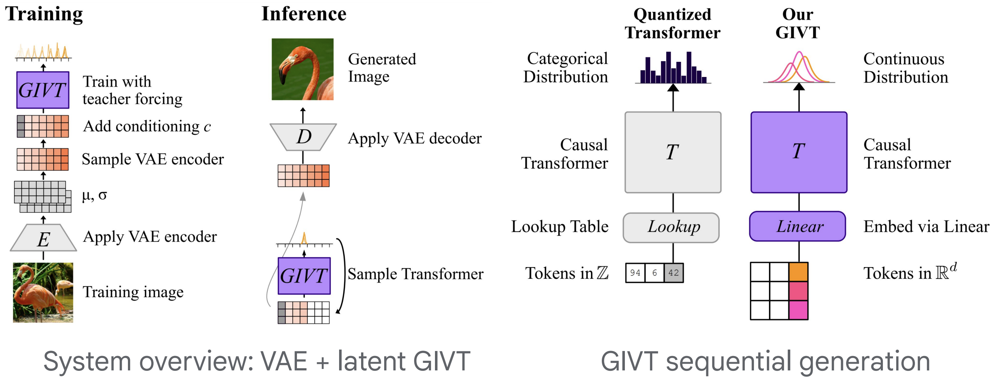

# GIVT: Generative Infinite-Vocabulary Transformers

*by Michael Tschannen, Cian Eastwood, Fabian Mentzer* [[arxiv]](https://arxiv.org/abs/2312.02116) [[colab]](https://colab.research.google.com/github/google-research/big_vision/blob/main/big_vision/configs/proj/givt/givt_demo_colab.ipynb)




### Summary

We introduce generative infinite-vocabulary transformers (GIVT) which generate vector sequences with real-valued entries, instead of discrete tokens from a finite vocabulary.
To this end, we propose two surprisingly simple modifications to decoder-only transformers: 1) at the input, we replace the finite-vocabulary lookup table with a linear projection of the input vectors; and 2) at the output, we replace the logits prediction (usually mapped to a categorical distribution) with the parameters of a multivariate Gaussian mixture model.
Inspired by the image-generation paradigm of VQ-GAN and MaskGIT, where transformers are used to model the discrete latent sequences of a VQ-VAE, we use GIVT to model the unquantized real-valued latent sequences of a &beta;-VAE.
In class-conditional image generation GIVT outperforms VQ-GAN (and improved variants thereof) as well as MaskGIT, and achieves performance competitive with recent latent diffusion models.
Finally, we obtain strong results outside of image generation when applying GIVT to panoptic segmentation and depth estimation with a VAE variant of the UViM framework.

### Checkpoints

We provide model checkpoints for a subset of the models from the paper.
These are meant as small-scale baselines for researchers interested in exploring GIVT, and are not optimized to provide the best possible visual quality (e.g. scaling the model size can substantially improve visual quality as shown in the paper).
See below for instructions to train your own models.

**ImageNet 2012 VAEs**

| &beta;     | 1e-5 | 2.5e-5 | 5e-5 | 1e-4 | 2e-4 |
|:-----------|:------:|:----:|:----:|:----:|:----:|
| checkpoint | [link][vae_i1k_0] | [link][vae_i1k_1] | [link][vae_i1k_2] | [link][vae_i1k_3] | [link][vae_i1k_4] |

[vae_i1k_0]: https://storage.googleapis.com/big_vision/givt/vae_imagenet_2012_beta_1e-5_params
[vae_i1k_1]: https://storage.googleapis.com/big_vision/givt/vae_imagenet_2012_beta_2p5e-5_params
[vae_i1k_2]: https://storage.googleapis.com/big_vision/givt/vae_imagenet_2012_beta_5e-5_params
[vae_i1k_3]: https://storage.googleapis.com/big_vision/givt/vae_imagenet_2012_beta_1e-4_params
[vae_i1k_4]: https://storage.googleapis.com/big_vision/givt/vae_imagenet_2012_beta_2e-4_params

**Class-conditional ImageNet 2012 generative models**

| model | resolution | &beta; | inference | FID | checkpoint |
|:------|:----------:|:------:|:-------------|:---:|:-----------|
| GIVT-Causal | 256 x 256 | 5e-5 | t=0.95, DB-CFG=0.4 | 3.35 | [link][givt_i1k_1] |
| GIVT-MaskGIT | 256 x 256 | 5e-5 | t_C=35, DB-CFG=0.1 | 4.53 |  [link][givt_i1k_2] |
| GIVT-MaskGIT | 512 x 512 | 5e-5 | t_C=140 | 4.86 |  [link][givt_i1k_3] |

[givt_i1k_1]: https://storage.googleapis.com/big_vision/givt/givt_imagenet_2012_causal_params.npz
[givt_i1k_2]: https://storage.googleapis.com/big_vision/givt/givt_imagenet_2012_maskgit_params.npz
[givt_i1k_3]: https://storage.googleapis.com/big_vision/givt/givt_imagenet_2012_maskgit_512_params.npz


**UViM**

| task | model | dataset | accuracy | checkpoint |
|:-----|:------|:--------|---------:|:-----------|
| Panoptic segmentation | VAE (stage 1) | [COCO (2017)] | 71.0 (PQ) | [link][vae_coco_panoptic] |
| Panoptic segmentation | GIVT (stage 2) | [COCO (2017)] | 40.2 (PQ) | [link][givt_coco_panoptic] |
| Depth estimation | VAE (stage 1) | [NYU Depth v2] | 0.195 (RMSE) | [link][vae_nyu_depth] |
| Depth estimation | GIVT (stage 2) | [NYU Depth v2] | 0.474 (RMSE) | [link][givt_nyu_depth] |

[NYU Depth v2]: https://cs.nyu.edu/~silberman/datasets/nyu_depth_v2.html
[COCO (2017)]: https://cocodataset.org/#home
[vae_coco_panoptic]: https://storage.googleapis.com/big_vision/givt/vae_coco_panoptic_params.npz
[givt_coco_panoptic]: https://storage.googleapis.com/big_vision/givt/givt_coco_panoptic_params.npz
[vae_nyu_depth]: https://storage.googleapis.com/big_vision/givt/vae_nyu_depth_params.npz
[givt_nyu_depth]: https://storage.googleapis.com/big_vision/givt/givt_nyu_depth_params.npz

### Training models

This directory contains configs to train GIVT models as well as VAEs (for the UViM variants).
For training the ImageNet 2012 VAE models we used a modified version of the [MaskGIT code](https://github.com/google-research/maskgit).

The `big_vision` input pipeline relies on [TensorFlow Datasets (TFDS)](https://www.tensorflow.org/datasets) 
which supports some data sets out-of-the-box, whereas others require manual download of the data
(for example ImageNet and COCO (2017), see the `big_vision` [main README](../../../../#cloud-tpu-vm-setup) and the [UViM README](../uvim), respectively, for details).

After setting up `big_vision` as described in the [main README](../../../../#cloud-tpu-vm-setup), training can be launched locally as follows

```
python -m big_vision.trainers.proj.givt.generative \
  --config big_vision/configs/proj/givt/givt_imagenet2012.py \
  --workdir gs://$GS_BUCKET_NAME/big_vision/`date '+%m-%d_%H%M'`
```

Add the suffix `:key1=value1,key2=value2,...` to the config path in the launch
command to modify the config with predefined arguments (see config for details). For example:
`--config big_vision/configs/proj/givt/givt_imagenet_2012.py:model_size=large`.
Note that `givt_imagenet2012.py` uses [Imagenette](https://github.com/fastai/imagenette) to ensure that the config is runnable without manual ImageNet download.
This is only meant for testing and will overfit immediately. Please download ImageNet to reproduce the paper results.

VAE trainings for the GIVT variant of UViM can be launched as

```
python -m big_vision.trainers.proj.givt.vae \
  --config big_vision/configs/proj/givt/vae_nyu_depth.py \
  --workdir gs://$GS_BUCKET_NAME/big_vision/`date '+%m-%d_%H%M'`
```

Please refer to the [main README](../../../../#cloud-tpu-vm-setup)
for details on how to launch training on a (multi-host) TPU setup.


### Disclaimer

This is not an official Google Product.


### Citation
```
@article{tschannen2023givt,
  title={GIVT: Generative Infinite-Vocabulary Transformers},
  author={Tschannen, Michael and Eastwood, Cian and Mentzer, Fabian},
  journal={arXiv:2312.02116},
  year={2023}
}
```