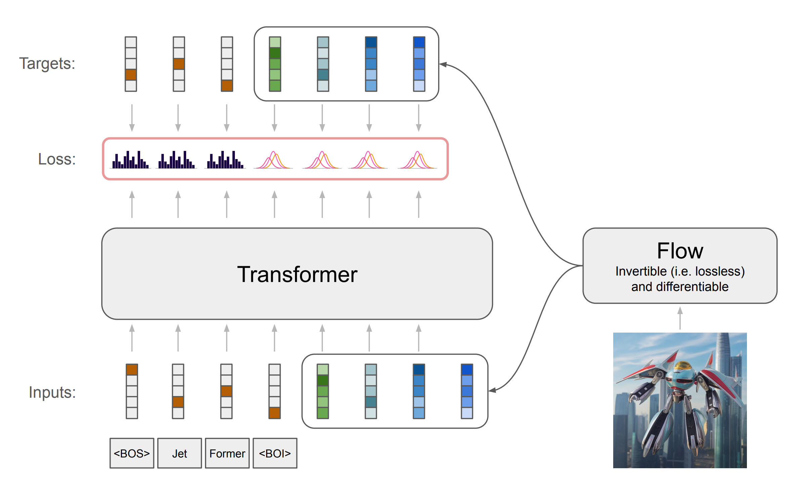

# JetFormer: An Autoregressive Generative Model of Raw Images and Text

*by Michael Tschannen\*, André Susano Pinto\*, Alexander Kolesnikov\** [[arxiv]](https://arxiv.org/abs//2411.19722)

### Summary

Removing modeling constraints and unifying architectures across domains has
been a key driver of the recent progress in training large multimodal models.
However, most of these models still rely on many separately trained components
such as modality-specific encoders and decoders. In this work, we further
streamline joint generative modeling of images and text. We propose an
autoregressive decoder-only transformer - JetFormer - which is trained to
directly maximize the likelihood of raw data, without relying on any separately
pretrained components, and can understand and generate both text and images.
Specifically, we leverage a normalizing flow model to obtain a soft-token image
representation that is jointly trained with an autoregressive multimodal
transformer. The normalizing flow model serves as both an image encoder for
perception tasks and an image decoder for image generation tasks during
inference. JetFormer achieves text-to-image generation quality competitive with
recent VQ-VAE- and VAE-based baselines. These baselines rely on pretrained
image autoencoders, which are trained with a complex mixture of losses,
including perceptual ones. At the same time, JetFormer demonstrates robust image
understanding capabilities. To the best of our knowledge, JetFormer is the
first model that is capable of generating high-fidelity images and producing
strong log-likelihood bounds.

### Training models

Please see the [main README](https://github.com/google-research/big_vision) for
how to set up the codebase and training data sets in your preferred environment.
Use the commands in the config headers to train models.