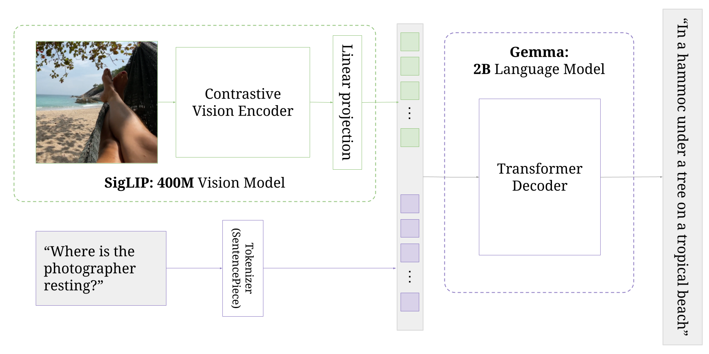

# PaliGemma model README

PaliGemma is an open vision-language model (VLM) inspired by PaLI-3, built with
open components, such as
the [SigLIP vision model](https://colab.research.google.com/github/google-research/big_vision/blob/main/big_vision/configs/proj/image_text/SigLIP_demo.ipynb)
and
the [Gemma language model](https://ai.google.dev/gemma).
PaliGemma is designed as a versatile model for transfer to a wide range of
vision-language tasks such as image and short video caption, visual question
answering, text reading, object detection and object segmentation. Together with
the pretrained and transfer checkpoints at multiple resolutions, we provide a
checkpoint transferred to a mixture of tasks that can be used for off-the-shelf
exploration.

## Quick Reference

This is the reference repository of the model, you may also want to check out the resources on

 - [Kaggle](https://www.kaggle.com/models/google/paligemma):
 All checkpoints and model card.
 - [VertexAI Model Garden](https://console.cloud.google.com/vertex-ai/publishers/google/model-garden/363):
 Paligemma models on GCP.
 - [Hugging Face](https://huggingface.co/google/paligemma-3b-pt-224):
 PyTorch port of paligemma models.
 - [Light finetuning colab](https://colab.research.google.com/github/google-research/big_vision/blob/main/big_vision/configs/proj/paligemma/finetune_paligemma.ipynb):
  Lightweight colab for fine-tuning PaliGemma. It can be run on a single T4 GPU (16GB)
  available on free Colab.
 - [HuggingFace demo](https://hf.co/spaces/google/paligemma): live demo.

## Model description

### Overview

PaliGemma-3B is Vision-Language model that was inspired by the PaLI-3 recipe.
It is built on SigLIP visual encoder (specifically, SigLIP-So400m/14) and the
Gemma 2B language model. PaliGemma takes as input one or more images,
which are turned into "soft tokens" by the SigLIP encoder, and input text
(codenamed the "prefix") that is tokenized by Gemma's tokenizer. The image
tokens and prefix tokens are concatenated (in this order) and passed to the
Gemma decoder with full block-attention, which then generates an output text
(the "suffix") auto-regressively with masked attention.



### Training stages

Similar to PaLI-3, PaliGemma's training consists of multiple stages:

  - Stage 0: the unimodal pre-training. We use publicly available off-the-shelf
  SigLIP and Gemma models which have been pre-trained unimodally by their
  respective authors.
  - Stage 1: multimodal pre-training. The combined PaliGemma model is now
  pre-trained on a fully multimodal training dataset, this at a low resolution
  of 224px² and prefix+suffix sequence length of 128 tokens. This results in
  the first base model that we release.
  - Stage 2: high-resolution pre-training. We continue pre-training of the
  Stage 1 model at resolution 448px² with sequence length 512 tokens for a short
  duration on the same multimodal training data, but re-weighted with more
  emphasis on examples that make use of higher resolution or longer sequence
  length. We repeat this once more at resolution 896px². This results in two
  further "high res" base models that we also release.
  - Stage 3: fine-tune. The base models are transferred to
  specific tasks by fine-tuning. To facilitate further research and
  reproducibility, we release checkpoints fine-tuned on most of the benchmarks
  we evaluate on. We also provide a "mix" transfer model, fine-tuned on a wide
  variety of data, for use in interactive demos.

Most of the code examples, use-cases, and code release are about Stage 3:
transferring to a task or dataset of interest to the user. 

### Tokenizer

PaliGemma uses the Gemma tokenizer with 256'000 tokens, but we further extend
its vocabulary with 1024 entries that represent coordinates in normalized
image-space (\<loc0000>...\<loc1023>), and another with 128 entries
(\<seg000>...\<seg127>) that are codewords used by a lightweight
referring-expression segmentation vector-quantized variational auto-encoder
(VQ-VAE) with the architecture of [Ning et al. (2023)](https://arxiv.org/abs/2301.02229) and trained on OpenImages
as in PaLI-3. While the `big_vision` codebase is flexible enough to extend
tokenizers on-the-fly, we also provide a SentencePiece model file of the Gemma
tokenizer with these additional tokens baked in, for the convenience of
other codebases.

## Checkpoints

The PaliGemma models are released under the same open license as the Gemma
models, and hence require manual acknowledgement of the license terms on kaggle:
https://www.kaggle.com/models/google/paligemma. The reference checkpoints are
available on
[Kaggle](https://www.kaggle.com/models/google/paligemma),
[VertexAI Model Garden](https://console.cloud.google.com/vertex-ai/publishers/google/model-garden/363) and
[Hugging Face](https://huggingface.co/google/paligemma-3b-pt-224).

### Pretrained checkpoints

Use one of these checkpoints as initialization for fine-tuning:

  - pt-224: Versatile pretrained model for tasks that do not require seeing
  small details in the image.
  Examples: natural image captioning and question-answering, detection and
  segmentation of medium-large objects. This model was trained with
  sequence length 128.
  - pt-448: Versatile base model for mid/higher resolution tasks with access
  to smaller details. Besides higher resolution, it has gotten more weight on
  text reading, detection, and segmentation during its pre-training. Examples:
  as above, plus detection, segmentation, text/diagram reading. This model was
  trained with sequence length 512.
  - pt-896: Further scaled-up version of pt-448, especially good at reading
  very small texts as often found in documents and infographics. This model
  was trained with sequence length 512.

Besides the reference float32 checkpoint (11GB), we further provide
bfloat16 and float16 variants of each, to reduce download and storage time.
These are good for inference and frozen transfers, but full fine-tuning
should happen in float32 or mixed precision.

### Mixture checkpoint

This checkpoint is trained on a mixture of all our transfer tasks,
with a balancing intended to make it "nice to use" out of the box for
predictions. This model is multilingual and should
understand prompts in various languages, although English
is still its "mother tongue".
Questions can be asked in a natural way (including asking for a caption or
reading the text), and detection and segmentation should still work with the
structured `detect {things}` and `segment {things}` prompts as in the base model.

  - mix-224: Similarly to pt-224, this model is good at many natural image
  tasks that do not require high resolution. Unlike the raw pre-trained model,
  however, it can be interacted with more freely. For example, ask it to
  "describe this image in great detail, please" or "How many coins do you see
  in the picture?". This model was trained with sequence length 256.
  - mix-448: As above, but it is better at tasks that require higher-resolution
  input. For example, one could ask it "what is written in the "sum" field?",
  to "describe this figure", or to "what is the GDP of France?" when shown an
  infographic of countries' GDPs. This model was trained with
  sequence length 512.

### Transfers results and checkpoints

We provide checkpoints transferred to most of the tasks we evaluated
transfer on, see the [kaggle page](https://www.kaggle.com/models/google/paligemma).
These are intended for use when a specialised model corresponding
to one of the tasks is needed, for academic research purposes only.
Depending on the task, they may require a specialised preprocessing format.

The transfer setup is reasonably unified, with the main factors of variation
being the training duration, learning-rate, and whether or not to use dropout
and label-smoothing. Details can be found in the corresponding config files or
in an upcoming tech report.

Importantly, none of these tasks or datasets are part of the pre-training data
mixture, and their images are explicitly removed from the web-scale
pretraining data.

#### Captioning

Benchmark (train split) | Metric (split) | pt-224 | pt-448 | pt-896
-----------------------|----------------|--------|--------|--------
[COCO captions](https://cocodataset.org/#home) (train+restval) | CIDEr (val) | 141.92 | 144.60 | 
[NoCaps](https://nocaps.org/) (Eval of COCO captions transfer) | CIDEr (val) | 121.72 | 123.58 | 
[COCO-35L](https://arxiv.org/abs/2205.12522) (train) | CIDEr dev (en / avg-34 / avg) | 139.2 / 115.8 / 116.4 | 141.2 / 118.0 / 118.6 | 
[XM3600](https://arxiv.org/abs/2205.12522) (Eval of COCO-35L transfer) | CIDEr test (en / avg-35 / avg) | 78.1 / 41.3 / 42.4 | 80.0 / 41.9 / 42.9 | 
[TextCaps](https://textvqa.org/textcaps/) (train) | CIDEr (val) | 127.48 | 153.94 | 
[SciCap](https://arxiv.org/abs/2110.11624) (first sentence, no subfigure) (train+val) | CIDEr / BLEU-4 (test) | 162.25 / 0.192 | 181.49 / 0.211 | 
[Screen2words](https://arxiv.org/abs/2108.03353) (train+dev) | CIDEr (test) | 117.57 | 119.59 | 
[Widget Captioning](https://arxiv.org/abs/2010.04295) (train+dev) | CIDEr (test) | 136.07 | 148.36 | 

#### Question Answering

Benchmark (train split) | Metric (split) | pt-224 | pt-448 | pt-896
-----------------------|----------------|--------|--------|--------
[VQAv2](https://visualqa.org/index.html) (train+validation) | Accuracy (Test server - std) | 83.19 | 85.64 | 
[MMVP](https://arxiv.org/abs/2401.06209) (Eval of VQAv2 transfer) | Paired Accuracy | 47.33 | 45.33 | 
[POPE](https://arxiv.org/abs/2305.10355) (Eval of VQAv2 transfer) | Accuracy (random / popular / adversarial) | 87.80 / 85.87 / 84.27 | 88.23 / 86.77 / 85.90 | 
[OKVQA](https://okvqa.allenai.org/) (train) | Accuracy (val) | 63.54 | 63.15 | 
[A-OKVQA](https://allenai.org/project/a-okvqa/home) (MC) (train+val) | Accuracy (Test server) | 76.37 | 76.90 | 
[A-OKVQA](https://allenai.org/project/a-okvqa/home) (DA) (train+val) | Accuracy (Test server) | 61.85 | 63.22 | 
[GQA](https://cs.stanford.edu/people/dorarad/gqa/about.html) (train_balanced+val_balanced) | Accuracy (testdev balanced) | 65.61 | 67.03 | 
[xGQA](https://aclanthology.org/2022.findings-acl.196/) (Eval of GQA transfer) | Mean Accuracy (bn,de,en,id,ko,pt,ru,zh) | 58.37 | 59.07 | 
[NLVR2](https://lil.nlp.cornell.edu/nlvr/) (train+dev) | Accuracy (test) | 90.02 | 88.93 | 
[MaRVL](https://marvl-challenge.github.io/) (Eval of NLVR2 transfer) | Mean Accuracy (test) (id,sw,ta,tr,zh) | 80.57 | 76.78 | 
[AI2D](https://allenai.org/data/diagrams) (train) | Accuracy (test) | 72.12 | 73.28 | 
[ScienceQA](https://scienceqa.github.io/) (Img subset, no CoT) (train+val) | Accuracy (test) | 95.39 | 95.93 | 
[RSVQA-LR](https://zenodo.org/records/6344334) (Non numeric) (train+val) | Mean Accuracy (test) | 92.65 | 93.11 | 
[RSVQA-HR](https://zenodo.org/records/6344367) (Non numeric) (train+val) | Mean Accuracy (test/test2) | 92.61 / 90.58 | 92.79 / 90.54 | 
[ChartQA](https://arxiv.org/abs/2203.10244) (human+aug)x(train+val) | Mean Relaxed Accuracy (test_human, test_aug) | 57.08 | 71.36 | 
[VizWiz](https://vizwiz.org/tasks-and-datasets/vqa/) VQA (train+val) | Accuracy (Test server - std) | 73.7 | 75.52 | 
[TallyQA](https://arxiv.org/abs/1810.12440) (train) | Accuracy (test_simple/test_complex) | 81.72 / 69.56 | 84.86 / 72.27 | 
[OCR-VQA](https://ocr-vqa.github.io/) (train+val) | Accuracy (test) | 72.32 | 74.61 | 74.93
[TextVQA](https://textvqa.org/) (train+val) | Accuracy (Test server - std) | 55.47 | 73.15 | 76.48
[DocVQA](https://www.docvqa.org/) (train+val) | ANLS (Test server) | 43.74 | 78.02 | 84.77
[Infographic VQA](https://openaccess.thecvf.com/content/WACV2022/papers/Mathew_InfographicVQA_WACV_2022_paper.pdf) (train+val) | ANLS (Test server) | 28.46 | 40.47 | 47.75
[SceneText VQA](https://arxiv.org/abs/1905.13648) (train+val) | ANLS (Test server) | 63.29 | 81.82 | 84.40

#### Segmentation

Benchmark (train split) | Metric (split) | pt-224 | pt-448 | pt-896
-----------------------|----------------|--------|--------|--------
[RefCOCO](https://arxiv.org/abs/1608.00272) (combined refcoco, refcoco+, refcocog excluding val and test images) | MIoU (validation) refcoco / refcoco+ / refcocog | 73.40 / 68.32 / 67.65 | 75.57 / 69.76 / 70.17 | 76.94 / 72.18 / 72.22

#### Video tasks (Caption/QA)

Benchmark (train split) | Metric (split) | pt-224 | pt-448 | pt-896
-----------------------|----------------|--------|--------|--------
[MSR-VTT](https://www.microsoft.com/en-us/research/publication/msr-vtt-a-large-video-description-dataset-for-bridging-video-and-language/) (Captioning) | CIDEr (test) | 70.54 | 
[MSR-VTT](https://www.microsoft.com/en-us/research/publication/msr-vtt-a-large-video-description-dataset-for-bridging-video-and-language/) (QA) | Accuracy (test) | 50.09 | 
[ActivityNet](http://activity-net.org/) (Captioning)] | CIDEr (test) | 34.62 | 
[ActivityNet](http://activity-net.org/) (QA) | Accuracy (test) | 50.78 | 
[VATEX](https://eric-xw.github.io/vatex-website/about.html) (Captioning) | CIDEr (test) | 79.73 | 
[MSVD](https://www.cs.utexas.edu/users/ml/clamp/videoDescription/) (QA) | Accuracy (test) | 60.22 |

#### Mix model (finetune on mixture of transfer tasks)

Benchmark | Metric (split) | mix-224 | mix-448
----------|----------------|---------|---------
[MMVP](https://arxiv.org/abs/2401.06209) | Paired Accuracy | 46.00 | 45.33
[POPE](https://arxiv.org/abs/2305.10355) | Accuracy (random / popular / adversarial) | 88.00 / 86.63 / 85.67 | 89.37 / 88.40 / 87.47


## How to run PaliGemma fine-tuning

To run PaliGemma fine-tuning, set up the `big_vision` repository by following the
main README file. Here we provide PaliGemma-specific instructions.

Checkpoints can be downloaded from Kaggle. You need to create an account and acknowledge checkpoint usage policy. You can then download any checkpoint:

```
export KAGGLE_USERNAME=
export KAGGLE_KEY=

# See https://www.kaggle.com/models/google/paligemma for a full list of models.
export MODEL_NAME=paligemma-3b-pt-224
export CKPT_FILE=paligemma-3b-pt-224.npz

mkdir ckpts/
cd ckpts/

curl -L -u $KAGGLE_USERNAME:$KAGGLE_KEY\
  -o pt_224.npz \
  https://www.kaggle.com/api/v1/models/google/paligemma/jax/$MODEL_NAME/1/download/$CKPT_FILE
```

As an example, we provide the `forkme.py` config that is based on the easily-adjustable jsonl data source:

```
BV_GEMMA_DIR=ckpts/ python -m big_vision.trainers.proj.paligemma.train --config big_vision/configs/proj/paligemma/transfers/forkme.py --workdir workdirs/`date '+%m-%d_%H%M'`
```

If you want to use TFDS-based data, check out other transfer configs. Remember to set `TFDS_DATA_DIR` to point to the folder with data (can be GCP data bucket).


## Model Development Contributions

### Core Contributors

Lucas Beyer \
Andreas Steiner \
André Susano Pinto \
Alexander Kolesnikov \
Xiao Wang \
Xiaohua Zhai

### Contributors

Daniel Salz \
Maxim Neumann \
Ibrahim Alabdulmohsin \
Michael Tschannen \
Jeremiah Harmsen \
Daniel Keysers \
Neil Houlsby \
Xi Chen \
Emanuele Bugliarello \
Thomas Unterthiner \
Keran Rong \
Matthias Minderer \
Ioana Bica \
Ivana Balazevic \
Joan Puigcerver \
Julian Eisenschlos \
Manoj Kumar \
Matko Bošnjak \
Matthias Bauer \
Fangyu Liu \
Adam Grycner \
Alexey Gritsenko \
Paul Voigtlaender \
Pinelopi Papalampidi \
Olivier Henaff \
Skanda Koppula \
Xi Xiong \
Radu Soricut

### Leads

Xiaohua Zhai \
Lucas Beyer

## Model Release Contributions and General Support

### PM

Tris Warkentin

### Go-to-Market 

Kat Black \
Luiz Gustavo Martins \
Glenn Cameron \
Raj Gundluru \
Manvinder Singh

### Kaggle

Meg Risdal \
Nilay Chauhan \
Nate Keating \
Nesh Devanathan


### Documentation

Elisa Bandy \
Joe Fernandez

### Ethics and Safety

Antonia Paterson \
Jenny Brennan \
Tom Eccles \
Pankil Botadra \
Ben Bariach

### Vertex AI

Lav Rai \
Minwoo Park \
Dustin Luong \
Daniel Vlasic \
Bo Wu \
Wenming Ye

### Keras

Divya S \
Jeff Carpenter \
Kiranbir Sodhia

### Gemma Model

Alek Andreev \
Armand Joulin \
Surya Bhupatiraju \
Minh Giang

### Executive Sponsors

Joelle Barral \
Zoubin Ghahramani
